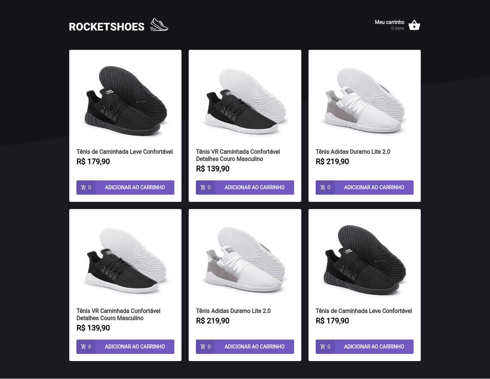
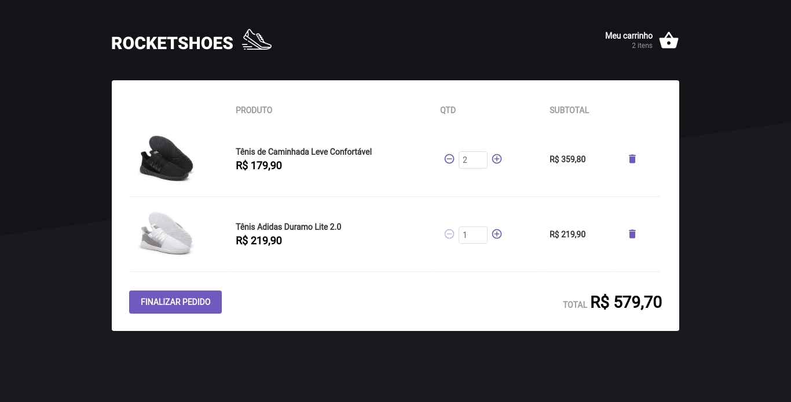
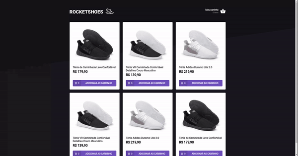

	
	
  
  
  <a href="https://github.com/caiofuccio">
	  
	<a/>
  

 

<h1  align="center">
  
</h1>
 

 <a href="#-sobre">Sobre</a> •
 <a href="#-funcionalidades">Funcionalidades</a> •
 <a href="#-layout">Layout</a> • 
 <a href="#-como-executar">Como executar</a> • 
 <a href="#-tecnologias">Tecnologias</a> • 
 <a href="#-autor">Autor</a> •
 <a href="#-licença">Licença</a>

 

<h4 align="center"> 
	🎊   Finalizado   🎊
</h4>
 

---

## 💻 Sobre

O Rocketshoes é um dos desafio proposto pela RocketSeat na trilha de React do bootcamp Ignite de 2021.

A aplicação é uma página web para compra de calçados, que consta com uma home e um carrinho de compras. Nela você pode adicionar e remover os calçados, bem como acrescentar ou reduzir a quantidade de cada item até a disponibilidade de estoque.

Ela foi feita utilizando React e Typescript e o servidor utilizado é do tipo Fake API com JSON Server. Para preservar os estados foi utilizado o Local Storage e, por fim, para apresentar as mensagens de erro e alertas foi utilizado o Toastify.

 

---

## ⚙️ Funcionalidades

Nesse projeto foi criada uma aplicação de um site de compra de calçados, onde o desafio principal era a criação de um hook do carrinho de compras.

A aplicação conta com duas páginas, a Home e a Cart. Na página Home é possível:

- Visualizar todos os produtos.
- Adicioná-los ao carrinho de compra.
- Verificar a quantidade de cada produto adicionado no carrinho.
- Verificar quantos produtos distintos foram adicionados ao carrinho.

Na página Cart é possível:

- Aumentar ou reduzir a quantidade de cada item do carrinho.
- Remover um item do carrinho.
- Visualizar o subtotal de cada item.
- Visualizar o preço total da compra.

 

---

## 🖼️ Layout

 

 
 

  

 

---

## 🧰 Como executar

    # Clone o repositório
    $ git clone git@github.com:caiofuccio/shopping-cart.git

    # Instale as dependências
    $ yarn

    # Inicie a Fake API com JSON Server
    $ yarn server

    # Execute a aplicação
    $ yarn start

    # A aplicação será aberta na porta:3000 - acesse https://localhost:3000

 

---

## 🚀 Tecnologias

	
	
	 
	
	
  
	 
  
  
   

 

---

## 👨‍💻 Autor

	
	 
	<strong>Caio Fuccio</strong>
	 
	 Front-End Developer | ReactJS
	 
	 
	
	

 

---

## ⚖️ Licença

Este projeto está sob a licença MIT.

Acesse o arquivo de [LICENSE](./LICENSE) para mais informações.
